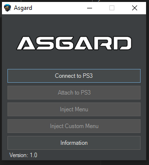

# Asgard_Releases

Black Ops 3 Zombies Menu
  + GSC Injector for Zombies and Multiplayer
  + Inject over _clientids.gsc and _duplicaterender_mgr.gsc
  + sprx should work on hen, i just didnt make eboots for it
  + SPRX is required! (including for clients if giving them access to the menu)
  
#Note
Dynamic string buffer is very small on last gen, with the sprx i increased it to 0x8000 but giving someone access to the menu once they exceed the original size it will kick them from the game
  
https://www.youtube.com/watch?v=jZ1xMfuSnJ8

The Jiggy_4_2.gsc is a Multiplayer gsc inject it with scripts/mp/gametypes/_clientids.gsc

Setting for jiggy - https://prnt.sc/jb7EQi_Ba0jm
